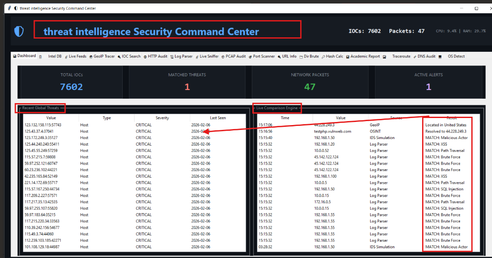
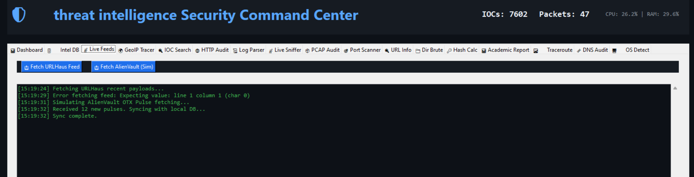
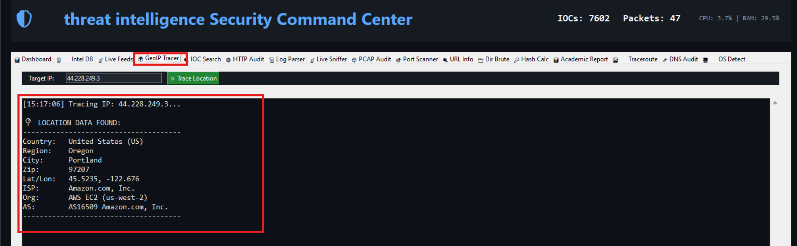
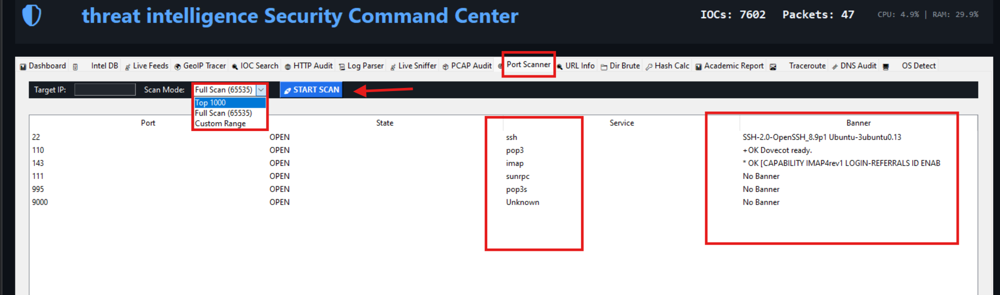
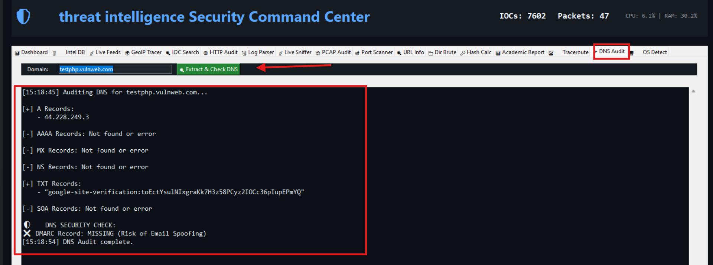
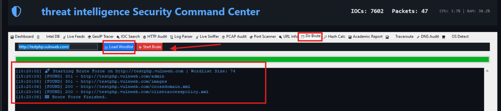

# 🛡️ Threat Intelligence Pro v1.0 - Cyber Command Center
> **منصة سيبرانية شاملة: تحليل استخباراتي، فحص ثغرات، وأدلة جنائية رقمية.**

---

## 📖 نظرة عامة (Overview)
هذا المشروع هو (Security Toolkit) متكامل تم تطويره بلغة **Python** ليكون مركز قيادة لمحللي الأمن السيبراني. يجمع النظام بين أدوات **الدفاع** (مثل تحليل السجلات وكشف التسلل) وأدوات **الهجوم/الفحص** (مثل فحص المنافذ واختبار المواقع)، مع واجهة رسومية (GUI) احترافية وتوليد تقارير تلقائية.


*خارطة الأدوات والوظائف داخل النظام*

---

## 📸 جولة تفصيلية داخل النظام (Features Showcase)

### 1. مركز القيادة والتحكم (Main Dashboard)
واجهة المراقبة المركزية. تعرض ملخصاً فورياً لحركة الشبكة، عدد الحزم الملتقطة، والتهديدات النشطة التي تم رصدها بواسطة محرك المقارنة المباشر (Live Comparison Engine).


---

### 2. جمع المعلومات والاستخبارات (Intelligence Gathering)
* **تغذية التهديدات الحية (Live Feeds):** جلب وتحديث قواعد بيانات التهديدات العالمية (مثل URLHaus و AlienVault) بضغطة زر.
  

* **إدارة قاعدة البيانات (Intel DB):** تخزين وإدارة الآلاف من مؤشرات الاختراق (IOCs) محلياً لسرعة الوصول.
  

* **البحث عن المؤشرات (IOC Search):** البحث السريع عن عناوين IP أو روابط مشبوهة داخل قاعدة البيانات المحلية.
  

---

### 3. استطلاع الشبكة والمواقع (Network Reconnaissance)
* **تتبع الموقع الجغرافي (GeoIP Tracer):** تحديد الموقع الفيزيائي لأي عنوان IP (الدولة، المدينة، مزود الخدمة) بدقة عالية.
  

* **فحص معلومات النطاق (URL Info & DNS):** استخراج سجلات DNS وعناوين IP المرتبطة بالنطاقات المستهدفة.
  !https://en.wikipedia.org/wiki/Info.com(10.png)

* **تتبع المسار (Traceroute):** رسم مسار الحزم عبر الشبكة لتحديد نقاط التوقف أو التأخير في الاتصال.
  

* **كشف نظام التشغيل (OS Detection):** استخدام تقنية (TTL Fingerprinting) لتخمين نظام تشغيل الهدف عن بُعد.
  

---

### 4. فحص الثغرات والأمان (Vulnerability Assessment)
* **فحص المنافذ المتقدم (Port Scanner):** فحص المنافذ المفتوحة والخدمات (Banner Grabbing) لتحديد نقاط الدخول المحتملة.
  

* **تدقيق بروتوكول HTTP (HTTP Audit):** تحليل ترويسات الأمان (Security Headers) وكشف النقص في إعدادات الحماية للمواقع.
  

* **تدقيق أمان DNS (DNS Audit):** التحقق من سجلات الأمان (SPF, DMARC) لكشف قابلية النطاق لهجمات انتحال البريد الإلكتروني (Email Spoofing).
  

* **اكتشاف المسارات المخفية (Directory Brute Force):** البحث عن المجلدات والملفات المخفية داخل خوادم الويب (مثل `/admin`, `/backup`).
  

---

### 5. الأدلة الجنائية وتحليل الشبكة (Forensics & Analysis)
* **تحليل الحزم المباشر (Live Sniffer):** التقاط وتحليل حركة المرور في الوقت الفعلي مع كشف لمحاولات الحقن (SQL Injection).
  

* **تحليل ملفات PCAP (Offline Analysis):** استيراد ملفات `pcap` وتحليلها لكشف أنماط الهجمات المتقدمة (مثل Cobalt Strike Beaconing).
  

* **محلل السجلات (Log Parser):** قراءة ملفات السجل (Logs) واستخراج محاولات الدخول الفاشلة وهجمات التخمين (Brute Force).
  

* **التحقق من سلامة الملفات (Hash Calculator):** حساب قيم التجزئة (MD5, SHA1, SHA256) للملفات للتأكد من عدم تلاعبها.
  

---

### 6. التقارير والتوثيق (Reporting)
* **توليد التقارير الأكاديمية (Academic Report):** يقوم النظام بجمع كافة نتائج الفحص والتحليل وتصديرها في تقرير نصي منسق وجاهز للطباعة أو التقديم.
  

---

## 🛠️ المتطلبات والتشغيل (Installation)

1. تأكد من تثبيت **Python 3.x**.
2. قم بتثبيت المكتبات اللازمة عبر الأمر التالي:
   ```bash
   pip install requests scapy psutil

   👤 فريق العمل (Credits)
تطوير وبرمجة: محمد عبد الله حسن العديني (الرقم الجامعي: 2023050626)

القسم: Cybersecurity

إشراف: د/ سندس سيف
